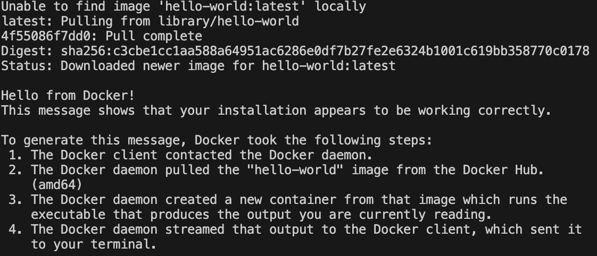
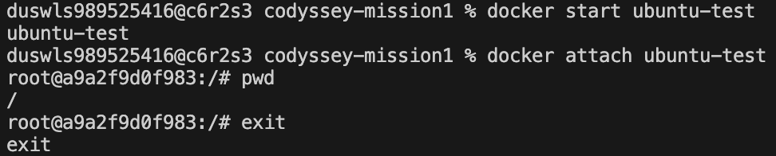
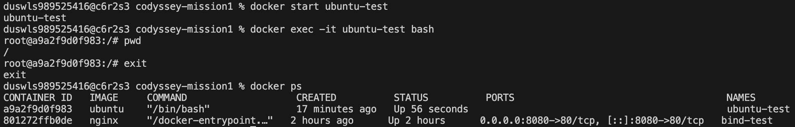
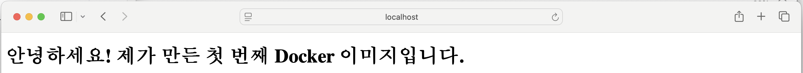
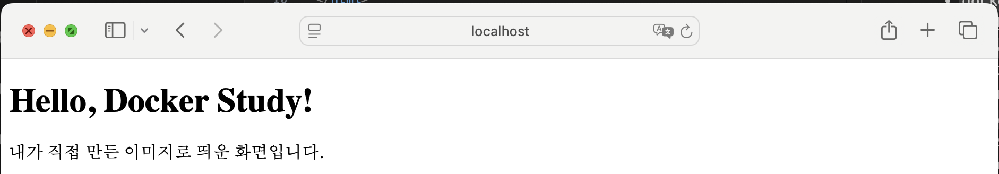
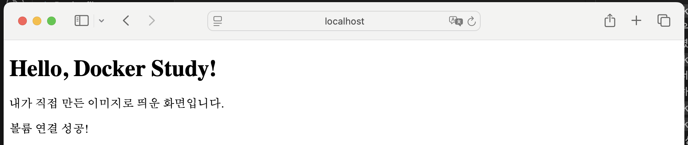
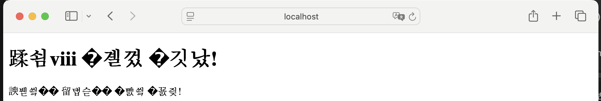
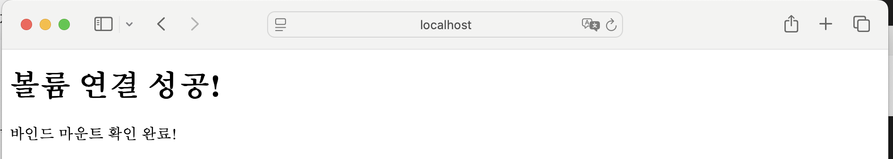

# Codyssey Mission 1 - 개발자용 작업실 꾸미기

## 1. 프로젝트 개요
이 프로젝트의 목표는 개발자가 사용하는 기본 작업 환경을 직접 구축해보는 것이다.

터미널(Linux CLI)을 이용한 파일 및 권한 관리, Docker를 활용한 컨테이너 실행과 웹 서버 구축, Git과 GitHub를 이용한 버전 관리 과정을 실습하였다.

또한 각 실습의 실행 결과와 검증 과정을 README에 기록하여 다른 사람이 동일한 절차를 따라 결과를 재현할 수 있도록 정리하였다.

## 2. 실행 환경

- OS : macOS 15.7.4
- Shell : zsh (/bin/zsh)
- Docker : 28.5.2
- Git : 2.53.0

## 3. 수행 체크리스트

### 3-1. 터미널 기본 조작

- [x] 터미널 기본 조작 및 폴더 구성

#### 사용한 명령어

- `pwd` 
- `ls -la` 
- `cd`
- `mkdir`
- `touch`
- `cp`
- `mv`
- `rm`
- `echo`
- `cat`
- `chmod`

#### 실행 결과

**1. 현재 위치 및 목록 확인**

```bash
pwd
ls -la
```

```text
/Users/duswls989525416/codyssey-mission1

total 32
drwxr-xr-x   6 duswls989525416  duswls989525416   192  7 30 15:52 .
drwxr-x---+ 25 duswls989525416  duswls989525416   800  8  1 13:23 ..
-rw-r--r--   1 duswls989525416  duswls989525416  6148  7 30 15:52 .DS_Store
drwxr-xr-x  13 duswls989525416  duswls989525416   416  7 30 16:10 .git
drwxr-xr-x   9 duswls989525416  duswls989525416   288  7 30 15:52 mission1
-rw-r--r--   1 duswls989525416  duswls989525416  4571  8  1 14:02 README.md
```

**2. 디렉터리 이동**

```bash
cd mission1
pwd
```

```text
/Users/duswls989525416/codyssey-mission1/mission1
```

**3. 디렉터리 생성**

```bash
mkdir practice
ls -la
```

```text
drwxr-xr-x   2 duswls989525416  duswls989525416     64  8  1 16:58 practice
```

**4. 파일 생성**

```bash
cd practice
touch hello.txt
ls -la
```

```text
-rw-r--r--   1 duswls989525416  duswls989525416    0  8  1 17:11 hello.txt
```

**5. 파일 복사**

```bash
cp hello.txt hello_copy.txt
ls -la
```

``` text
-rw-r--r--   1 duswls989525416  duswls989525416    0  8  1 17:31 hello_copy.txt
-rw-r--r--   1 duswls989525416  duswls989525416    0  8  1 17:11 hello.txt
```

**6. 파일 이름 변경**

```bash
mv hello_copy.txt hello2.txt
ls -la
```

```text
-rw-r--r--   1 duswls989525416  duswls989525416    0  8  1 17:11 hello.txt
-rw-r--r--   1 duswls989525416  duswls989525416    0  8  1 17:35 hello2.txt
```

**7. 파일 이동**

```bash
mv hello2.txt ..
ls -la
cd ..
ls -la
```

```text
practice 디렉터리
-rw-r--r--   1 duswls989525416  duswls989525416    0  8  1 17:11 hello.txt
mission1 디렉터리
-rw-r--r--   1 duswls989525416  duswls989525416      0  8  1 17:35 hello2.txt
```

**8. 파일 삭제**

```bash
rm hello2.txt
ls -la
```

삭제 후
`ls -la` 목록에서 `hello2.txt`가 사라진 것을 확인하였다.

**9. 파일 내용 입력 및 확인**

```bash
echo "Hello Codyssey" > hello.txt
cat hello.txt
```

```text
Hello Codyssey
```

**10. 파일 권한 변경**

```bash
chmod 600 test.txt
ls -la
```

```text
-rw-------   1 duswls989525416  duswls989525416     15 Aug  3 13:50 test.txt
```

**11. 디렉터리 권한 변경**

```bash
chmod 700 testdir
ls -ld testdir
```

```text
drwx------  3 duswls989525416  duswls989525416  96 Aug  3 13:50 testdir
```

#### 확인한 내용

- `pwd` 명령으로 현재 작업 디렉터리의 절대 경로를 확인하였다.
- `ls -la` 명령으로 숨김 파일을 포함한 파일 및 디렉터리의 상세 정보를 확인하였다.
- `cd` 명령으로 `mission1` 디렉터리로 이동하였다.
- `mkdir` 명령으로 `practice` 디렉터리를 생성하였다.
- `touch` 명령으로 `hello.txt` 파일을 생성하였다.
- `cp` 명령으로 `hello.txt` 파일을 `hello_copy.txt`로 복사하였다.
- `mv` 명령으로 `hello_copy.txt` 파일의 이름을 `hello2.txt`로 변경하였다.
- `mv` 명령으로 `hello2.txt` 파일을 상위 디렉터리(`..`)로 이동하였다.
- `rm` 명령으로 `hello2.txt` 파일을 삭제하였다.
- `echo` 명령으로 `hello.txt` 파일에 `Hello Codyssey` 내용을 저장하였다.
- `cat` 명령으로 `hello.txt` 파일의 내용을 확인하였다.
- `chmod 600` 명령으로 `test.txt` 파일의 권한을 `-rw-------`로 변경하였다.
- `chmod 700` 명령으로 `testdir` 디렉터리의 권한을 `drwx------`로 변경하였다.

### 3-2. Docker 실습

- [x] Docker 이미지 및 컨테이너 실습

#### 사용한 명령어

- `docker --version`
- `docker info`
- `docker run hello-world`
- `docker run -it --name ubuntu-test ubuntu`
- `ls`
- `echo "Hello Ubuntu"`
- `exit`
- `docker start ubuntu-test`
- `docker attach ubuntu-test`
- `pwd`
- `exit`
- `docker start ubuntu-test`
- `docker exec -it ubuntu-test bash`
- `pwd`
- `exit`
- `docker ps`
- `docker build`
- `docker run`
- `docker ps`
- `docker logs`
- `docker stats`
- `docker stop`
- `docker ps -a`
- `docker rm`
- `docker images`
- `docker run`의 `-v` 옵션
- `docker volume create`
- `docker volume ls`
- `docker exec`
- `docker rm -f`
- 

#### 실행 결과

**1. Docker 설치 및 데몬 동작 확인**

```bash
docker --version
docker info
```

```text
 Docker version 28.5.2, build ecc6942
 
 Client:
  Version:    28.5.2
  Context:    orbstack
  Debug Mode: false

 Server:
  Containers: 1
  Running: 1
  Paused: 0
  Stopped: 0
 ```

**2. hello world 컨테이너 실행**

```bash
docker run hello-world
```



**3. Ubuntu 컨테이너 실행 및 내부 명령어 수행**

```bash
docker run -it --name ubuntu-test ubuntu
ls
echo "Hello Ubuntu"
exit
```


**4. attach와 exec 동작 비교**

attach


exec


**5. 이미지 생성**

```bash
docker build -t my-nginx .
```

```text
[+] Building 8.1s (7/7) FINISHED
...
 => => naming to docker.io/library/my-nginx  
 ```

 **6. 컨테이너 실행**

 ```bash
 docker run -d -p 8080:80 --name my-nginx-container my-nginx
 ```

 ```text
 c755f315cc45718213e87067b743e2aeee6e7446d23c7dc500dd2174880689a3
 ```

 **7. 실행 중인 컨테이너 확인**

 ```bash
 docker ps
 ```

 ```text
 CONTAINER ID   IMAGE      STATUS         PORTS                     NAMES
c755f315cc45   my-nginx   Up 8 minutes   0.0.0.0:8080->80/tcp      my-nginx-container
```
`-p 8080:80` 옵션으로 호스트의 8080번 포트와 컨테이너의 80번 포트를 연결하였다. 브라우저에서 `http://localhost:8080`에 접속한 화면이다.


**8. 컨테이너 로그 확인**

```bash
docker logs my-nginx-container
```

```text
/docker-entrypoint.sh: Configuration complete; ready for start up
2026/08/03 06:54:35 [notice] 1#1: nginx/1.31.3
2026/08/03 06:54:35 [notice] 1#1: start worker processes
192.168.215.1 - - [03/Aug/2026:06:54:41 +0000] "GET / HTTP/1.1" 200 180 
192.168.215.1 - - [03/Aug/2026:06:56:05 +0000] "GET / HTTP/1.1" 200 198
```

**9. 컨테이너 리소스 확인**

```bash
docker stats --no-stream my-nginx-container
```

```text
CONTAINER ID   NAME                 CPU %     MEM USAGE / LIMIT     MEM %     NET I/O           BLOCK I/O         PIDS
cb1e52d478b5   my-nginx-container   0.00%     5.645MiB / 15.67GiB   0.04%     3.15kB / 1.82kB   16.7MB / 8.19kB   7
```

**10. 컨테이너 중지**

```bash
docker stop my-nginx-container
```

```text
my-nginx-container
```

**11. 컨테이너 정지 상태 확인**

```bash
docker ps -a
```

```text
CONTAINER ID   IMAGE      COMMAND                  CREATED       STATUS                      PORTS     NAMES
cb1e52d478b5   my-nginx   "/docker-entrypoint.…"   2 hours ago   Exited (0) 39 seconds ago             my-nginx-container
```

**12. 컨테이너 삭제**

```bash
docker rm my-nginx-container
docker ps -a
```

```text
my-nginx-container
CONTAINER ID   IMAGE     COMMAND   CREATED   STATUS    PORTS     NAMES
```

**13. Docker 이미지 확인**

```bash
docker images
```

```text
REPOSITORY   TAG       IMAGE ID       CREATED       SIZE
my-nginx     latest    79e5d98401fd   3 hours ago   161MB
```

**14. 바인드 마운트 확인**

```bash
docker run -d -p 8080:80 \
-v "$(pwd)/index.html:/usr/share/nginx/html/index.html" \
--name my-nginx-container \
my-nginx
```

호스트 파일 변경 전


브라우저에서 `http://localhost:8080`에 접속한 후 `index.html`을 수정하고 저장하였다.

호스트 파일 변경 후

이미지를 다시 빌드하거나 컨테이너를 다시 실행하지 않고 브라우저를 새로고침하자 변경된 내용이 즉시 반영되는 것을 확인하였다.

**15. 볼륨 영속성 검증**


```bash
docker volume create mission1-data
docker volume ls
```

```text
mission1-data

DRIVER    VOLUME NAME
local     mission1-data
```

컨테이너 삭제 전

```bash
docker run -d \
-v mission1-data:/usr/share/nginx/html \
--name volume-nginx-1 \
nginx

docker exec volume-nginx-1 \
sh -c 'echo "Volume persistence test" > /usr/share/nginx/html/test.txt'

docker exec volume-nginx-1 \
cat /usr/share/nginx/html/test.txt
```

```text
Volume persistence test
```

컨테이너 삭제 후

```bash
docker rm -f volume-nginx-1

docker run -d \
-v mission1-data:/usr/share/nginx/html \
--name volume-nginx-2 \
nginx

docker exec volume-nginx-2 \
cat /usr/share/nginx/html/test.txt
```

```text
Volume persistence test
```

#### 확인한 내용

- `docker --version` 명령으로 설치된 Docker 버전을 확인하였다.
- `docker info` 명령으로 Docker 클라이언트와 Docker 데몬이 정상적으로 통신하는 것을 확인하였다.
- 로컬에 이미지가 없으면 Docker Hub에서 자동으로 이미지를 다운로듷나ㅡㄴ 것을 확인하였다.
- 다운로드한 이미지를 이용하여 컨테이너를 생성하고 실행하는 것을 확인하였다.
- `hello-world` 이미지를 이용해 테스트용 컨테이너가 실행되고 "Hello from Docker!" 메시지가 출력되는 것을 확인하였다.
- 이를 통해 Docker 설치와 Docker 데몬이 정상적으로 동작하는 것을 확인하였다.
- 로컬에 Ubuntu 이미지가 없어 Docker Hub에서 자동으로 이미지를 다운로드하는 것을 확인하였다.
- Ubuntu 컨테이너 내부에 접속하여 `ls`와 `echo` 명령어를 실행할 수 있음을 확인하였다.
- `exit` 명령으로 컨테이너 내부 셸을 종료하고 호스트 터미널로 돌아오는 것을 확인하였다.
- `docker attach`는 실행 중인 컨테이너의 메인 프로세스에 연결되는 것을 확인하였다.
- Ubuntu 컨테이너에서는 메인 프로세스가 Bash이므로 `exit` 명령을 입력하면 컨테이너도 함께 종료되는 것을 확인하였다.
- `docker exec`는 실행 중인 컨테이너에서 새로운 Bash 프로세스를 실행하는 것을 확인하였다.
- `docker exec`에서 `exit` 명령을 입력해도 메인 프로세스는 계속 실행되므로 컨테이너가 종료되지 않는 것을 `docker ps` 명령으로 확인하였다.
- `docker build` 명령으로 `Dockerfile`을 기반으로 `my-nginx` 이미지를 생성하였다.
- `docker run` 명령으로 이미지를 실행하여 `my-nginx-container` 컨테이너를 생성하였다.
- `docker ps` 명령으로 실행 중인 컨테이너와 포트 연결 상태를 확인하였다.
- `docker logs` 명령으로 Nginx가 정상적으로 시작되었고, 브라우저 요청에 HTTP 상태 코드 `200`으로 응답한 기록을 확인하였다.
- `docker stats --no-stream` 명령으로 실행 중인 컨테이너의 CPU, 메모리, 네트워크 및 디스크 사용량을 한 번만 출력하여 확인하였다.
- `docker stop` 명령으로 컨테이너 실행을 중지하였다.
- `docker ps -a` 명령으로 중지된 컨테이너가 `Exited (0)` 상태로 남아 있는 것을 확인하였다.
- `docker rm` 명령으로 중지된 컨테이너를 삭제하였다.
- `docker images` 명령으로 생성한 컨테이너를 삭제한 뒤에도 `my-nginx` 이미지가 유지되는 것을 확인하였다.
- `-v` 옵션을 사용하여 호스트의 `index.html`과 컨테이너 내부의 `index.html`을 바인드 마운트하고, 파일 수정 내용이 즉시 반영되는 것을 확인하였다.
- `docker volume create` 명령으로 `mission1-data` 볼륨을 생성하였다.
- 첫 번째 컨테이너에서 볼륨이 연결된 경로에 `test.txt` 파일을 생성하였다.
- 첫 번째 컨테이너를 삭제한 뒤 같은 볼륨을 연결한 두 번째 컨테이너에서 `test.txt`의 내용을 다시 확인하였다.
- 이를 통해 Docker 볼륨에 저장된 데이터는 컨테이너를 삭제해도 유지되는 영속성이 있음을 확인하였다.

### 3-3. Git 설정 및 GitHub연동

- [x] Git 사용자 정보와 기본 브랜치를 설정하고 GitHub 저장소 연동을 확인함

#### 사용한 명령어

- `git config --global user.name "duswls98952"`
- `git config --global user.email "duswls98952@naver.com"`
- `git config --global init.defaultBranch main`
- `git config --list`
- `git remote -v`

#### 실행 결과

```bash
git config --list
```

```text
credential.helper=osxkeychain
user.name=duswls98952
user.email=duswls98952@naver.com
init.defaultbranch=main
remote.origin.url=http://github.com/duswls98952/codyssey-mission1.git
branch.main.remote=origin
branch.main.merge=refs/heads/main
```
```bash
git remote -v
```

```text
origin  http://github.com/duswls98952/codyssey-mission1.git (fetch)
origin  http://github.com/duswls98952/codyssey-mission1.git (push)
```

#### 확인한 내용

- Git 사용자 이름과 이메일이 정상적으로 설정된 것을 확인하였다.
- 기본 브랜치가 `main`으로 설정된 것을 확인하였다.
- 로컬 저장소의 `origin`이 GitHub 원ㄴ격 저장소와 연결된 것을 확인하였다.
- `fetch`와 `push`에 동일한 우너격 저장소 주소가 사용되는 것을 확인하였다.

## 4. 트러블슈팅
### 4-1. Git 파일 경로 오류

**문제**

`mission1` 디렉터리 안에서 다음 명령을 실행하였다.

```bash
git add README.md
```

```text
fatal: pathspec 'README.md' did not match any files
```

**원인**

`README.md`는 저장소 루트에 있지만 현재 위치는 하위 `mission1` 디렉터리였기 때문에 해당 경로에서 파일을 찾지 못했다.

**해결**
```bash
cd ..
git add README.md
```

저장소 루트로 이동한 뒤 다시 실행하여 해결하였다.

### 4-2. HTML 한글 깨짐 문제
**문제**
한글 깨짐 문제의 원인을 확인하기 위해 HTML 문서에서 `<meta charset="UTF-8">` 설정을 제거하자, Nginx 웹페이지의 한글이 정상적으로 표시되지 않는 현상이 재현되었다.



**원인**
HTML 문서에서 문자 인코딩 방식이 명확하게 지정되지 않아 브라우저가 한글 데이터를 올바르게 해석하지 못했다.

**해결**
`index.html`의 `<head>`에 다음 태그를 추가하였다.

```html
<meta charset="UTF-8">
```

UTF-8문자 인코딩을 명시한 뒤 한글이 정상적으로 표시되는 것을 확인하였다.



## 5. 과제 완료 소감
- Git과 Docker의 기본 사용법을 직접 실습하며 개발 환경을 구성하는 과정을 경험할 수 있었습니다.
- 특히 파일 권한 변경, 바인드 마운트, Docker Volume의 영속성을 직접 확인하면서 명령어의 동작 원리를 이해하는 데 도움이 되었습니다.
