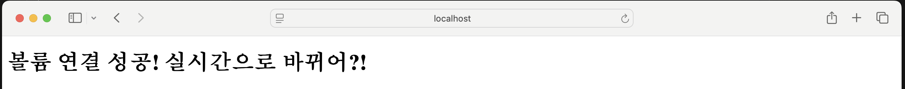

# Codyssey Mission 1 - 개발자용 작업실 꾸미기

## 1. 프로젝트 개요
이 프로젝트의 목표는 개발자가 사용하는 기본 작업 환경을 직접 구축해보는 것이다.

터미널(Linux CLI)을 이용한 파일 및 권한 관리, Docker를 활용한 컨테이너 실행과 웹 서버 구축, Git과 GitHub를 이용한 버전 관리 과정을 실습하였다.

또한 각 실습의 실행 결과와 검증 과정을 README에 기록하여 다른 사람이 동일한 절차를 따라 결과를 재현할 수 있도록 정리하였다.

## 2. 실행 환경

- OS : macOS 15.7.4
- Shell : zsh (/bin/zsh)
- Docker : 28.5.2
- Git : 2.53.0

## 3. 수행 체크리스트

### 3-1. 터미널 기본 조작

- [x] 터미널 기본 조작 및 폴더 구성

#### 사용한 명령어

- `pwd` 
- `ls -la` 
- `cd`
- `mkdir`
- `touch`
- `cp`
- `mv`
- `rm`
- `echo`
- `cat`
- `chmod`

#### 실행 결과

**1. 현재 위치 및 목록 확인**

```bash
pwd
ls -la
```

```text
/Users/duswls989525416/codyssey-mission1

total 32
drwxr-xr-x   6 duswls989525416  duswls989525416   192  7 30 15:52 .
drwxr-x---+ 25 duswls989525416  duswls989525416   800  8  1 13:23 ..
-rw-r--r--   1 duswls989525416  duswls989525416  6148  7 30 15:52 .DS_Store
drwxr-xr-x  13 duswls989525416  duswls989525416   416  7 30 16:10 .git
drwxr-xr-x   9 duswls989525416  duswls989525416   288  7 30 15:52 mission1
-rw-r--r--   1 duswls989525416  duswls989525416  4571  8  1 14:02 README.md
```

**2. 디렉터리 이동**

```bash
cd mission1
pwd
```

```text
/Users/duswls989525416/codyssey-mission1/mission1
```

**3. 디렉터리 생성**

```bash
mkdir practice
ls -la
```

```text
drwxr-xr-x   2 duswls989525416  duswls989525416     64  8  1 16:58 practice
```

**4. 파일 생성**

```bash
cd practice
touch hello.txt
ls -la
```

```text
-rw-r--r--   1 duswls989525416  duswls989525416    0  8  1 17:11 hello.txt
```

**5. 파일 복사**

```bash
cp hello.txt hello_copy.txt
ls -la
```

``` text
-rw-r--r--   1 duswls989525416  duswls989525416    0  8  1 17:31 hello_copy.txt
-rw-r--r--   1 duswls989525416  duswls989525416    0  8  1 17:11 hello.txt
```

**6. 파일 이름 변경**

```bash
mv hello_copy.txt hello2.txt
ls -la
```

```text
-rw-r--r--   1 duswls989525416  duswls989525416    0  8  1 17:11 hello.txt
-rw-r--r--   1 duswls989525416  duswls989525416    0  8  1 17:35 hello2.txt
```

**7. 파일 이동**

```bash
mv hello2.txt ..
ls -la
cd ..
ls -la
```

```text
practice 디렉터리
-rw-r--r--   1 duswls989525416  duswls989525416    0  8  1 17:11 hello.txt
mission1 디렉터리
-rw-r--r--   1 duswls989525416  duswls989525416      0  8  1 17:35 hello2.txt
```

**8. 파일 삭제**

```bash
rm hello2.txt
ls -la
```

삭제 후
`ls -la` 목록에서 `hello2.txt`가 사라진 것을 확인하였다.

**9. 파일 내용 입력 및 확인**

```bash
echo "Hello Codyssey" > hello.txt
cat hello.txt
```

```text
Hello Codyssey
```

**10. 파일 권한 변경**

```bash
chmod 600 test.txt
ls -la
```

```text
-rw-------   1 duswls989525416  duswls989525416     15 Aug  3 13:50 test.txt
```

**11. 디렉터리 권한 변경**

```bash
chmod 700 testdir
ls -ld testdir
```

```text
drwx------  3 duswls989525416  duswls989525416  96 Aug  3 13:50 testdir
```

#### 확인한 내용

- `pwd` 명령으로 현재 작업 디렉터리의 절대 경로를 확인하였다.
- `ls -la` 명령으로 숨김 파일을 포함한 파일 및 디렉터리의 상세 정보를 확인하였다.
- `cd` 명령으로 `mission1` 디렉터리로 이동하였다.
- `mkdir` 명령으로 `practice` 디렉터리를 생성하였다.
- `touch` 명령으로 `hello.txt` 파일을 생성하였다.
- `cp` 명령으로 `hello.txt` 파일을 `hello_copy.txt`로 복사하였다.
- `mv` 명령으로 `hello_copy.txt` 파일의 이름을 `hello2.txt`로 변경하였다.
- `mv` 명령으로 `hello2.txt` 파일을 상위 디렉터리(`..`)로 이동하였다.
- `rm` 명령으로 `hello2.txt` 파일을 삭제하였다.
- `echo` 명령으로 `hello.txt` 파일에 `Hello Codyssey` 내용을 저장하였다.
- `cat` 명령으로 `hello.txt` 파일의 내용을 확인하였다.
- `chmod 600` 명령으로 `test.txt` 파일의 권한을 `-rw-------`로 병경하였다.
- `chmod 700` 명령으로 `testdir` 디렉터리의 권한을 `drwx------`로 변경하였다.

### 3-2. Docker 실습

- [x] Docker 이미지 및 컨테이너 실습

#### 사용한 명령어

- `docker info`
- `docker build`
- `docker run`
- `docker ps`
- `docker logs`
- `docker stats`
- `docker stop`
- `docker ps -a`
- `docker rm`
- `docker images`
- `docker run -v` 옵션

#### 실행 결과

**1. Docker 데몬 동작 확인**

```bash
docker info
```

```text
Client:
 Version:    28.5.2
 Context:    orbstack
 Debug Mode: false

 Server:
 Containers: 1
  Running: 1
  Paused: 0
  Stopped: 0
 ```

**2. 이미지 생성**

```bash
docker build -t my-nginx .
```

```text
[+] Building 8.1s (7/7) FINISHED
...
 => => naming to docker.io/library/my-nginx  
 ```

 **3. 컨테이너 실행**

 ```bash
 docker run -d -p 8080:80 --name my-nginx-container my-nginx
 ```

 ```text
 c755f315cc45718213e87067b743e2aeee6e7446d23c7dc500dd2174880689a3
 ```

 **4. 실행 중인 컨테이너 확인**

 ```bash
 docker ps
 ```

 ```text
 CONTAINER ID   IMAGE      STATUS         PORTS                     NAMES
c755f315cc45   my-nginx   Up 8 minutes   0.0.0.0:8080->80/tcp      my-nginx-container
```

**5. 컨테이너 로그 확인**

```bash
docker logs my-nginx-container
```

```text
/docker-entrypoint.sh: Configuration complete; ready for start up
2026/08/03 06:54:35 [notice] 1#1: nginx/1.31.3
2026/08/03 06:54:35 [notice] 1#1: start worker processes
192.168.215.1 - - [03/Aug/2026:06:54:41 +0000] "GET / HTTP/1.1" 200 180 
192.168.215.1 - - [03/Aug/2026:06:56:05 +0000] "GET / HTTP/1.1" 200 198
```

**6. 컨테이너 리소스 확인**

```bash
docker stats --no-stream my-nginx-container
```

```text
CONTAINER ID   NAME                 CPU %     MEM USAGE / LIMIT     MEM %     NET I/O           BLOCK I/O         PIDS
cb1e52d478b5   my-nginx-container   0.00%     5.645MiB / 15.67GiB   0.04%     3.15kB / 1.82kB   16.7MB / 8.19kB   7
```

**7. 컨테이너 중지**

```bash
docker stop my-nginx-container
```

```text
my-nginx-container
```

**8. 컨테이너 정지 상태 확인**

```bash
docker ps -a
```

```text
ONTAINER ID   IMAGE      COMMAND                  CREATED       STATUS                      PORTS     NAMES
cb1e52d478b5   my-nginx   "/docker-entrypoint.…"   2 hours ago   Exited (0) 39 seconds ago             my-nginx-container
```

**9. 컨테이너 삭제**

```bash
docker rm my-nginx-container
docker ps -a
```

```text
my-nginx-container
CONTAINER ID   IMAGE     COMMAND   CREATED   STATUS    PORTS     NAMES
```

**10. Docker 이미지 확인**

```bash
docker images
```

```text
REPOSITORY   TAG       IMAGE ID       CREATED          SIZE
my-nginx     latest    79e5d98401fd   22 minutes ago   161MB
```

**11. 바인드 마운트 확인**

```bash
docker run -d -p 8080:80 \
-v "$(pwd)/index.html:/usr/share/nginx/html/index.html" \
--name my-nginx-container \
my-nginx
```
브라우저에서 `http://localhost:8080`에 접속한 후 `index.html`을 수정하고 저장하였다.
이미지를 다시 빌드하고나 컨테이너를 다시 실행하지 않고 브라우저를 새로고침하자 변경된 내용이 즉시 반영되는 것을 확인하였다.


**12. 볼륨 영속성 검증**

#### 확인한 내용

- `docker info` 명령으로 Docker 클라이언트와 Docker 데몬이 정상적으로 통신하는 것을 확인하였다.
- `docker build` 명령으로 `Dockerfile`을 기반으로 `my-nginx` 이미지를 생성하였다.
- `docker run` 명령으로 이미지를 실행하여 `my-nginx-conainer` 컨테이너를 생성하였다.
- `docker ps` 명령으로 실행 중인 컨테이너와 포트 연결 상태를 확인하였다.
- `docker logs` 명령으로 Nginx가 정상적으로 시작되었고, 브라우저 요청에 HTTP 상태 코드 `200`으로 응답한 기록을 확인하였다.
- `docker stats --no-stream` 명령으로 실행 중인 컨테이너의 CPU, 메모리, 네트워크 및 디스크 사용량을 한 번만 출력하여 확인하였다.
- `docker stop` 명령으로 컨테이너 실행을 중지하였다.
- `docker ps -a` 명령으로 중지된 컨테이너가 `Exited(0)` 상태로 남아 있는 것을 확인하였다.
- `docker rm` 명령으로 중지된 컨테이너를 삭제하였다.
- `docker images` 명령으로 컨테이너를 삭제한 뒤에도 이미지가 유지되는 것을 확인하였다.
- `-v` 옵션을 사용하여 호스트의 `index.html`과 컨테이너 내부의 `index.html`을 바인드 마운트하고, 파일 수정 내용이 즉시 반영되는 것을 확인하였다.

#### 추가 확인

**1. Docker  데몬 동작 확인**


### 권한 변경
- [x] 권한 변경 실습
   - 파일('test.txt'): '-rw-r--r--' -> 'chmod 600' -> '-rw-------'
   - 디렉토리('testdir'): 'dr-xr-xr-x(555) -> 'chmod700' -> 'drwx------'
- [x] Docker 설치/점검
- [x] hello-world 실행
- [x] 'docker ps -a' 명령어로 컨테이너 상태 확인
- [x] Nginx 웹 서버 컨테이너 실행 및 브라우저 접속 성공
- [x] Docker Desktop 설치 완료
- [x] Docker 데몬 동작 확인 ('docker info')
   - Server Version: 28.5.2
   - Operation System: OrbStack (macOS 기반)
   - Kernel Version: 6.17.8-orbstack
   - Architecture: x86_64
   - CPUs:6, Total Memory: 15.67GiB
- [x] 커스텀 Docker 이미지 빌드 및 실행
   - Dockerfile 작성 (Nginx 베이스 이미지 활용)
   - index.html 작성 및 한글 깨짐 방지(UTF-8) 설정
   - 'docker build -t my-real-final .' 명령어로 이미지 생성
   - 'docker run -p 9000:80' 명령어로 포트 포워딩 및 브라우저 접속 확인
      
- [x] Docker 볼륨 영속성 검증
   - '-v "$PWD":/usr/share/nginx/html' 옵션을 사용하여 호스트와 컨테이너를 연결했습니다.
   - 소스코드 (index.html) 수정 시 빌드 없이도 실시간으로 반영되는 것을 확인했습니다.
      
   - 컨테이너를 삭제하고 다시 생성해도 데이터가 유지되는 영속성을 확인했습니다. 
      ('docker stop $(docker ps -q))
## 4. 트러블슈팅
- 사례1) Git 경로 오류
        문제: mission1 폴더 안에서 git add README.md 실행 시 파일 인식 불가 에러 발생.
        원인: 현재 작업 디렉토리가 상위 폴더가 아니어서 Git 파일을  찾지 못함.
        해결: 'cd ..' 명령어로 상위 디렉토리 이동 후 다시 시도하여 해결.
- 사례2) Docker 포트 매핑 또는 파일 인코딩 문제
        문제: Nginx 컨테이너 접속 시 한글 꺠짐 발생.
        원인: HTML 파일의 인코딩이 UTF-8로 설정되지 않음.
        해결: <meta charset="UTF-8"> 태그 추가 후 이미지 재빌드 및 컨테이너 실행.
## 5. Docker 운영/검증 로그
      5.1 docker stats 컨테이너 자원 사용량 확인
```bash
CONTAINER ID   NAME       CPU %     MEM USAGE / LIMIT     MEM %     NET I/O           BLOCK I/O   PIDS
f9849edab018   vol-test   0.00%     6.312MiB / 15.67GiB   0.04%     4.34kB / 2.77kB   18.2MB / 0B  7
```
      5.2 docker logs 컨테이너 접속 기록 확인
```bash
/docker-entrypoint.sh: Configuration complete; ready for start up
2026/07/29 10:31:17 [notice] 1#1: start worker processes
192.168.215.1 - - [29/Jul/2026:10:31:36 +0000] "GET / HTTP/1.1" 200 199 "-" "Mozilla/5.0..."
192.168.215.1 - - [29/Jul/2026:10:33:55 +0000] "GET / HTTP/1.1" 200 180 "-" "Mozilla/5.0..."
```  
      5.3 설치 및 점검 결과
   * **docker --version**
  ```text
  Docker version 28.5.2, build ecc6942
  ```
   * **docker info**
  ```text
  Operating System: OrbStack
  Architecture: x86_64
  CPUs: 6
  Total Memory: 15.67GiB
  Kernel Version: 6.17.8-orbstack-00308-g8f9c941121b1
  ```
      5.4 운영 명령 실행 흔적
   * **docker images**
   ```text
   REPOSITORY      TAG       IMAGE ID       CREATED        SIZE
   my-real-final   latest    f78d5cf33bb7   3 hours ago    161MB
   my-final-web    latest    434656709038   4 hours ago    161MB
   nginx           latest    4e5db4761e0f   13 days ago    161MB
   hello-world     latest    e2ac70e7319a   4 months ago   10.1kB
   ```
   * **docker ps -a**
   ```text
   CONTAINER ID   IMAGE     STATUS           PORTS                                     NAMES
   f9849edab018   nginx     Up About an hour 0.0.0.0:9001->80/tcp, [::]:9001->80/tcp   vol-test
   ```
   * **docker lofs**
   ```text
   192.168.215.1 - - [29/Jul/2026:10:33:55 +0000] "GET / HTTP/1.1" 200 180 "-" "Mozilla/5.0..."
   ```

## 5. 과제 완료 소감
- Git과 Docker의 기초적인 사용법을 익혔습니다.
- 특히 권한 설정과 볼륨 마운트 개념이 흥미로웠습니다.
